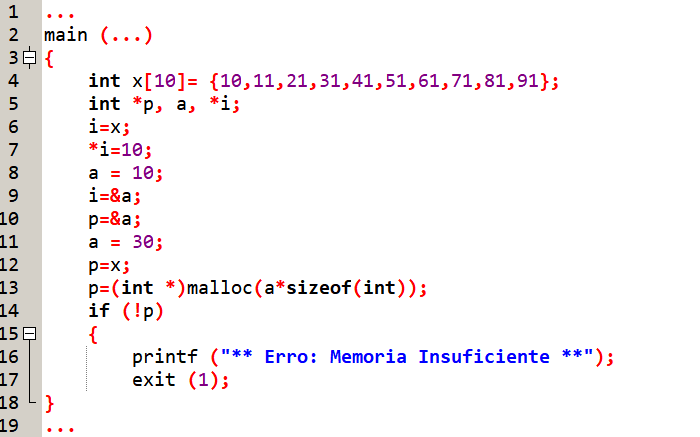
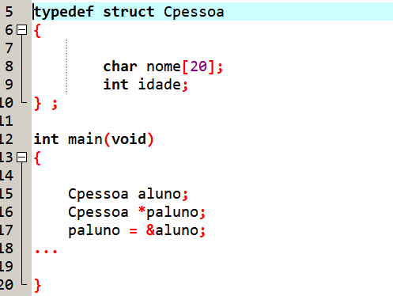

# Questões objetivas (1-20)

## 📌 1. Considerando o programa abaixo, responda:


**Escolha uma opção:**

- a.10
- b.21
- c.11
- d.91
- **e.30** ✅

---

## 📌 2. Considerando a estrutura Pessoa, como é possível acessar via ponteiro a propriedade nome?


- a. aluno.nome
- b. Cpessoa->nome
- c. aluno->nome
- d. Cpessoa.nome
- **e. paluno->nome** ✅

---

## 📌 3. Conhecendo parte da implementação do Código abaixo, Qual é o método de inserção de um Novo Nó a lista?

````c
Lista * set_lista(Lista * l, int a, char s[50]) {
 Lista * novo = (Lista *) malloc (sizeof(Lista));
 novo->matricula = a; 
 strcpy (novo->pessoa, s );
 novo->proximo = l;
 novo->anterior = NULL;
   if (l != NULL)
   l->anterior = novo;
return(novo);
}

void view_lista(Lista * l){
Lista * pl;
   for (pl = l; pl != NULL; pl = pl->proximo){
   printf("No %x Proximo: %x Anterior: %x \n", pl, pl->proximo, pl->anterior);
   }
}

int verifica_lista(Lista * l){
    if (l == NULL) 
     printf("\nLista Vazia\n"); 
    else
     printf("\nLista nao Vazia\n"); 
    }

Lista * find_lista(Lista * l, int argumento){
 Lista * pl;
   for (pl = l; pl != NULL; pl = pl->proximo) {
       if (pl->matricula == argumento)
       return (pl);    
   }
 return(NULL);
}

Lista * delete_elemento(Lista * pl, int argumento){
 Lista * anterior = NULL;
 Lista * atual = pl;
    while (atual != NULL && atual->matricula != argumento){
     anterior = atual;
     atual = atual->proximo;
   }

 if (atual == NULL) {
     printf ("Elemento noo localizado!\n"); 
     return(pl);
 }

 if (anterior == NULL){
       pl = pl->proximo; 
  } else  {
       anterior->proximo = atual->proximo;
  }
 free(atual);
 return(pl);
}

void free_lista(Lista ** pl){
 while (*pl != NULL){
     Lista * t = (*pl)->proximo;
     *pl = NULL;
     free(*pl);
     *pl = t;
 }
 }

void imprime_circular_rev (Lista* l){
   Lista* p = l; 
if (p) { 
     do {
         printf("Matricula: %d Nome: %s\n", p->matricula, p->pessoa) ; 
         p = p->proximo;
     }
     while (p != NULL);
    } 
}
````

**Escolha uma opção:**

- a.Inserção no inicio da lista, retornando último Nó
- b. Nenhuma das Alternativas.
- c.Inserção no final de lista, retornando o primeiro Nó
- d.Inserção no final de lista, retornando o último Nó
- **e.Inserção no inicio da lista, retornando o primeiro Nó** ✅

---

## 📌 4. Considerando o bloco de memória com endereço inicial **0xC8** e com tamanho de cada célula de **8 bits**:

| Endereço | Dado (ASCII) ou Endereço |
|----------|--------------------------|
| 0xC8     |                          |
| 0xC9     |                          |
| 0xCA     |                          |
| 0xCB     |                          |
| 0xCC     |                          |
| 0xCD     |                          |
| 0xCE     |                          |
| 0xCF     |                          |

### 💻 Trecho do Programa

```c
char palavra[3] = {'A','B','C'}; 
char *ppalavra = palavra;
````

**Explicação:** 
- Cada char ocupa 1 byte (8 bits)
- Endereço inicial de palavra = 0xCA

**Logo:** 'A' → 0xCA  // 'B' → 0xCB  //  'C' → 0xCC

- ppalavra guarda o endereço inicial de palavra, ou seja: 0xCA
- Endereço de ppalavra = 0xCF

**Resposta:**

| Endereço | Dado (ASCII) ou Endereço |
|----------|--------------------------|
| 0xC8     |                          |
| 0xC9     |                          |
| 0xCA     | 'A'                      |
| 0xCB     | 'B'                      |
| 0xCC     | 'C'                      |
| 0xCD     |                          |
| 0xCE     |                          |
| 0xCF     | 0xCA                     |

---

## 📌 5. Marque a alternativa correta:

**Escolha uma opção:**
- a. N.D.A.
- b. O operador * tem como significado o endereço de. O segundo operador é &, que é o complemento de &. O & é um operador unário que devolve o valor da variável localizada no endereço que indica. 
- c. O operador * tem como significado o valor de. O segundo operador é &, que é o complemento de *. O * é um operador unário que devolve o endereço da variável que indica.
- d. O operador & tem como significado o valor de. O segundo operador é *, que é o complemento de &. O * é um operador unário que devolve o endereço da variável que indica. 
- **e. O operador & tem como significado o endereço de. O segundo operador é (*), que é o complemento de &. O (*) é um operador unário que devolve o valor da variável localizada no endereço que indica.** ✅

---

## 📌 6. Marque a alternativa correta:

a. Em uma lista circular, o primeiro elemento tem como anterior o valor NULL para indicar o primeiro nó  da lista.
**b. Em uma lista circular, o último elemento tem como próximo o primeiro elemento da lista, o que forma um ciclo.** ✅
c. Em uma lista encadeada, o último elemento tem como próximo o primeiro elemento da lista, o que forma um ciclo.
d. Em uma lista circular, o último elemento tem como próximo o valor NULL para indicar o final da lista.
e. N.D.A.

---

## 📌 7. Dada parte do código abaixo, marque a alternativa Correta:
````c
int x[10]= {10,11,21,31,41,51,61,71,81,91};
int *p, a, *i;
i=&a;
p=&a;
a = 30;
p=x;
````
Se você quiser usar o conteúdo do ponteiro *p 9 posições adiante, deverá escrever:
- a. *p[9];
- b. (*p+9);
- c. &p[9];
- **d. *(p+9);*** ✅
- e. NDA;

---

## 📌 8. Complete o espaço em branco (______) com a palavra correta:

- A função _______, libera a memória alocada. >>> **FREE**
 - A função ______ realiza a alocação de memória, porém deve-se informar a quantidade de blocos que se deseja alocar (informar os Bytes e o tamanho de cada bloco). >>> **CALLOC**
 - Para determinar o tamanho alocado por uma variável, deve-se usar o comando _______.  >>> **SIZEOF**
 - A função ______ realiza a alocação de memória informada a quantidade de bytes que se deseja alocar. >>> **MALLOC**
 - A  função ______, serve para expandir uma área de memória alocada. >>> **REALLOC**

---

## 9. Dado a seguinte TAD abaixo, contendo uma estrutura chamada Triangulo, falta implementar a função (ou método) que cria o objeto triangulo e retorna o valor conforme especifico no cabeçalho do TAD. 

````c
#include <stdlib.h>
#include <stdio.h>
typedef struct triangulo Triangulo;
Triangulo * cria_triangulo(int a, int b, int c);
void free_triangulo(Triangulo ** t);
void set_triangulo(Triangulo * t, int a, int b, int c);
void get_triangulo(Triangulo * t);
struct triangulo
{
   int ladoa;
   int ladob;
   int ladoc;
};
Triangulo * cria_triangulo(int a, int b, int c)
{
.
.
.
.
.
.
.

}
void free_triangulo(Triangulo ** t)
{
  free(*t);
  *t = NULL;
}
void set_triangulo(Triangulo * t, int a, int b, int c){
   t->ladoa = a;
   t->ladob = b;
   t->ladoc = c;
}
void get_triangulo(Triangulo * t)
{if (t == NULL){
   printf("Erro de alocacao de memoria!\n");
}
else
{
   int a, b, c;
   a = t->ladoa;
   b = t->ladob;
   c = t->ladoc;
   if ((a == b) and (b == c))
    printf ("\nequilatero\n");
   else if ((a!=b) and (b!=c) and (c != a))
    printf ("\nescaleno\n");
   else
   printf ("\nisosceles\n");
}
}
````
Qual opção representa a forma correta de implementação da função Cria Triangulo?

- a.
````c
Triangulo  cria_triangulo(int a, int b, int c) {
 Triangulo * t = (Triangulo *) malloc (sizeof(Triangulo));
 if (t == NULL){
     printf("Erro de alocacao de memoria!\n");
     exit(1);
    } else {
     t->ladoa = a;
     t->ladob = b;
     t->ladoc = c;
     return Triangulo;
    }
}
````
> Retorno da função está errado: Triangulo (deveria ser `Triangulo *`). `return Triangulo;` → inválido ❌

- b.
````c
Triangulo * cria_triangulo(int a, int b, int c){
 Triangulo * t = (Triangulo *) malloc (sizeof(Triangulo));
 if (t != NULL){
     printf("Erro de alocacao de memoria!\n");
     exit(1);
    } else {
     t->ladoa = a;
     t->ladob = b;
     t->ladoc = c;
     return t;
    }
}
````
> Condição invertida: `if (t != NULL)` trata sucesso como erro ❌

- c. ✅
````
Triangulo * cria_triangulo(int a, int b, int c) {
 Triangulo * t = (Triangulo *) malloc (sizeof(Triangulo));
 if (t == NULL) {
     printf("Erro de alocacao de memoria!\n");
     exit(1);
    } else {
      t->ladoa = a;
      t->ladob = b;
      t->ladoc = c;
      return t;
    }
}
````
> ✔ Aloca memória corretamente com malloc
> 
> ✔ Verifica erro com t == NULL
> 
> ✔ Inicializa os campos da struct
> 
> ✔ Retorna o ponteiro t corretamente

- d.
````
Triangulo * cria_triangulo(int a, int b, int c) {
 Triangulo * t = (Triangulo *) malloc (sizeof(Triangulo));
 if (t == NULL) {
     printf("Erro de alocacao de memoria!\n");
     exit(1);
    } else {
     t->ladoa = a;
     t->ladob = b;
     t->ladoc = c;
     return * Triangulo;
    }
}
````
> `return * Triangulo;` → inválido (não faz sentido retornar isso) ❌

- e.
````
Triangulo * cria_triangulo(int a, int b, int c){
 Triangulo * t = (Triangulo *) malloc (sizeof(Triangulo));
 if (t != NULL){
     printf("Erro de alocacao de memoria!\n");
     exit(1);
  } else {
     t->ladoa = a;
     t->ladob = b;
     t->ladoc = c;
     return * Triangulo;
    }
````
> Mesmo erro da b (condição invertida). E também erro no `return * Triangulo` ❌

---- 
